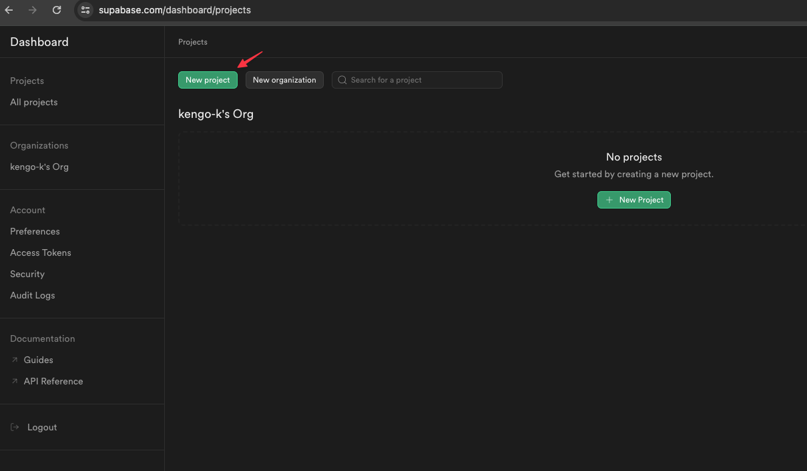
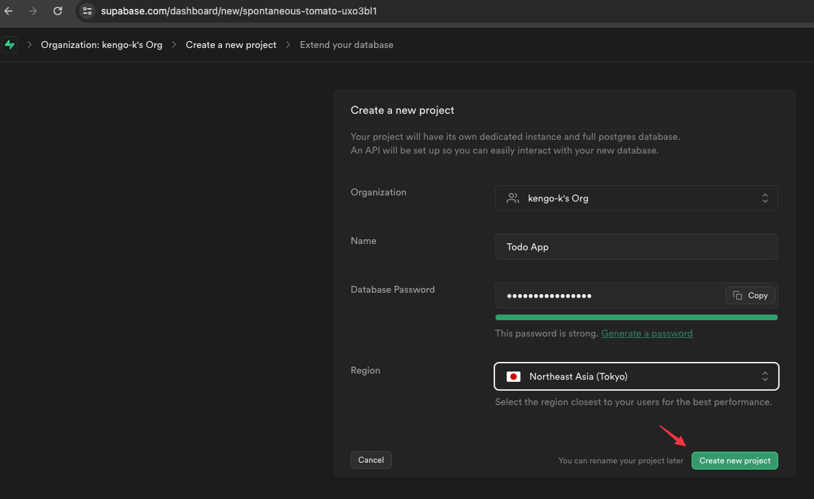
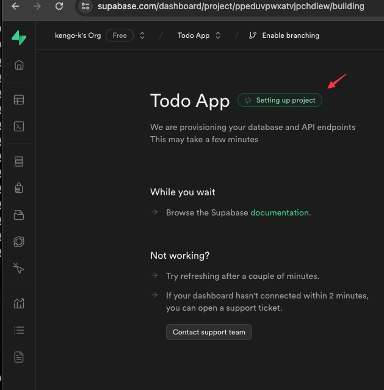
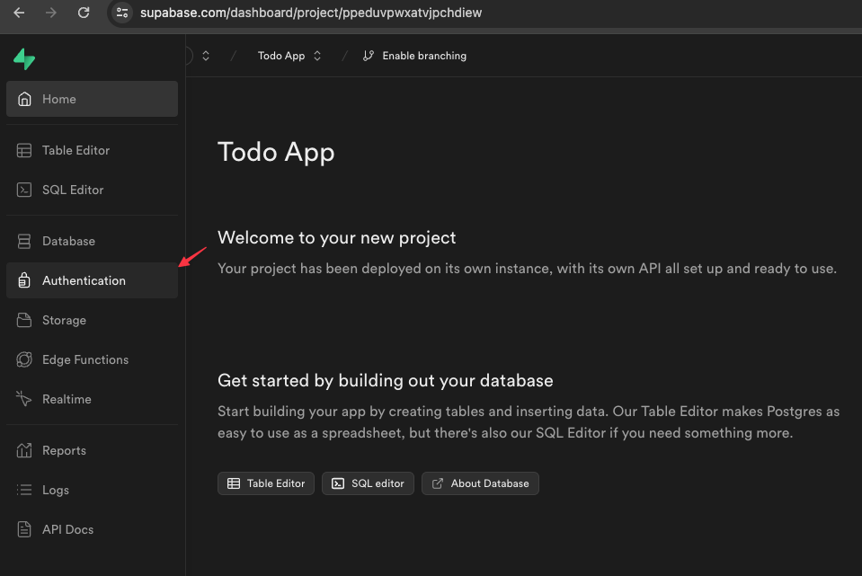
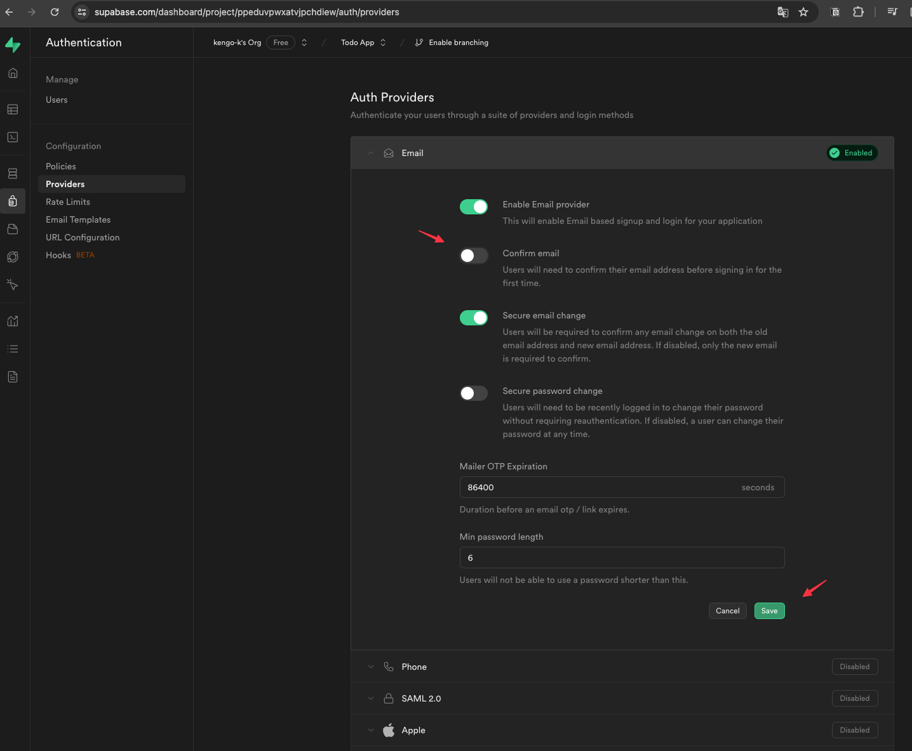
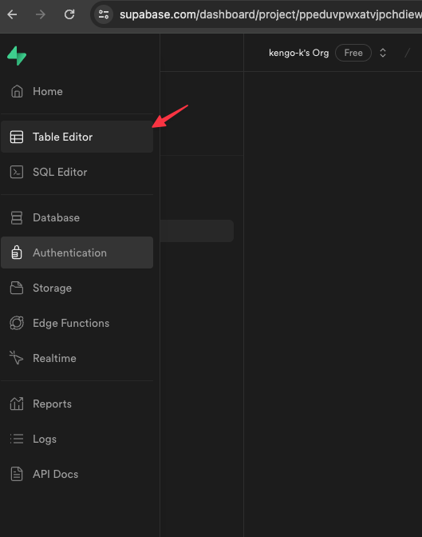
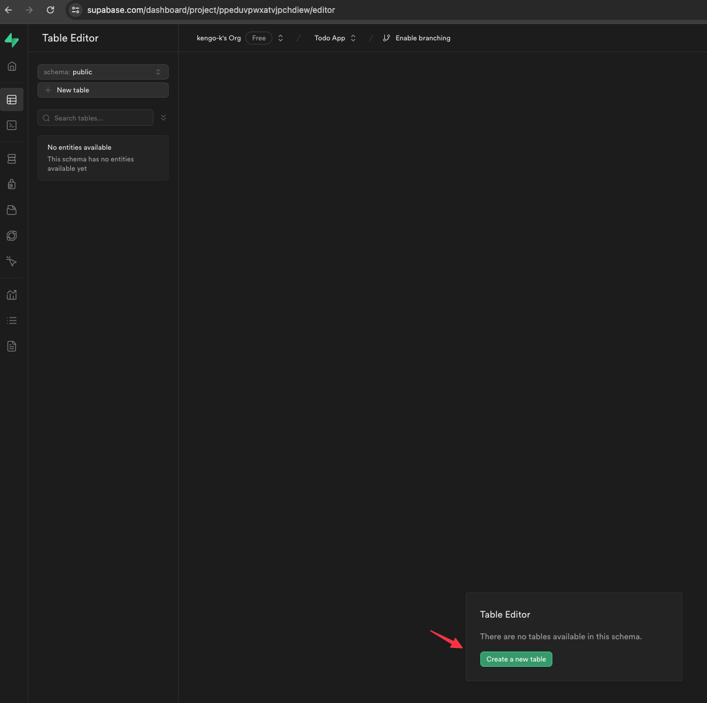

# Supabaseのセットアップ

## 「New project」をクリックする

## 下記の内容を設定し「Create new project」をクリックする

- Name: Todo App
- Database Password: 任意のパスワードを設定し控えておくこと
- Region: Northeast Asia (Tokyo)

## 初期化が完了するまで待つ

## 初期化が完了したら左メニューから「Authentication」をクリックする

## さらに「Providers」を選択し認証方法の一覧からEmailの設定を変更し「Save」をクリックする

- Confirm email: OFF

## 左メニューから「Table Editor」をクリックする

## 「Create a new table」をクリックする

