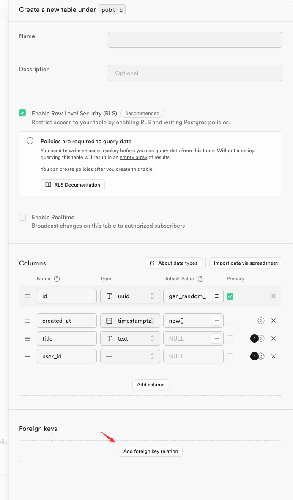
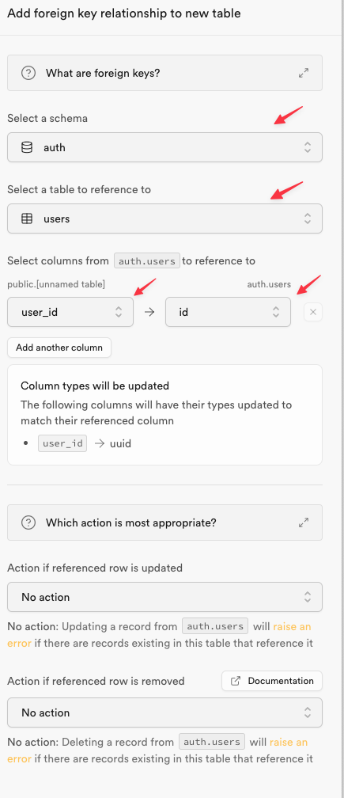
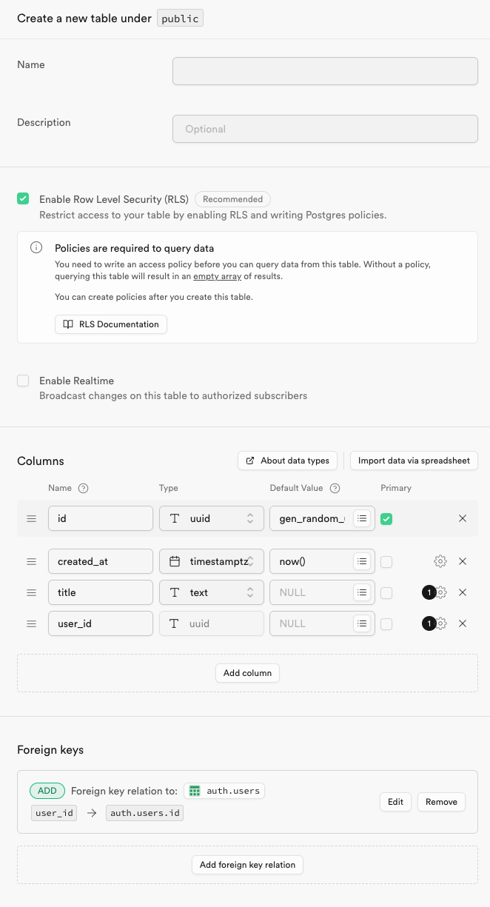
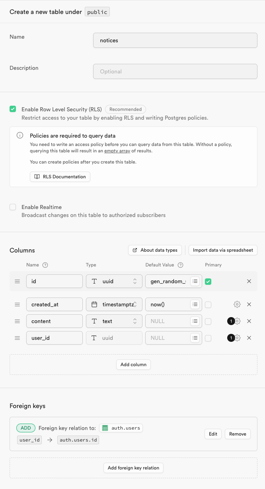
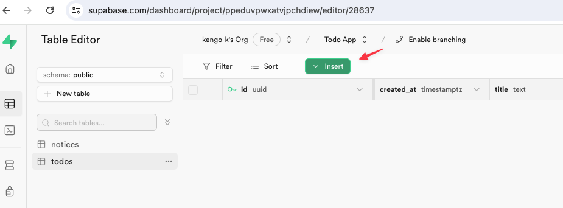
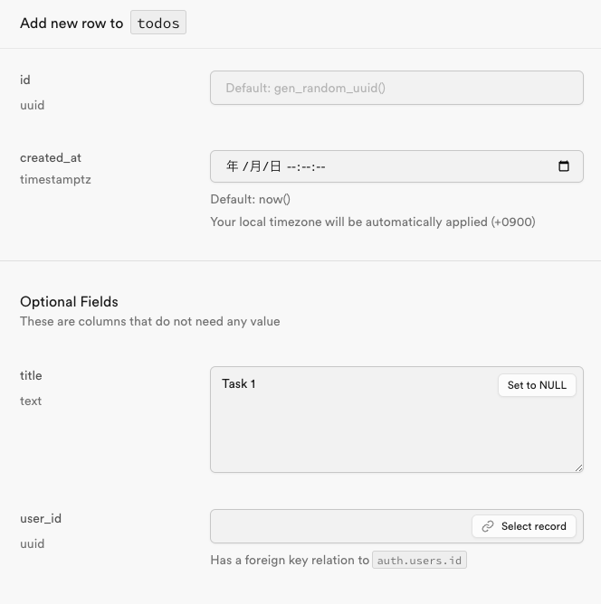
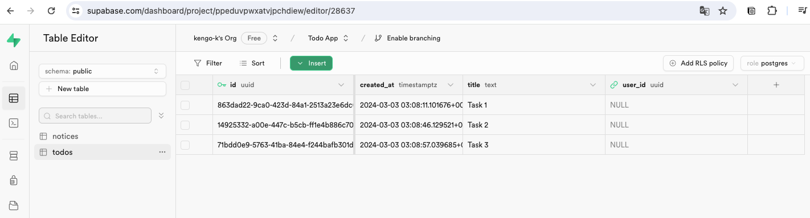
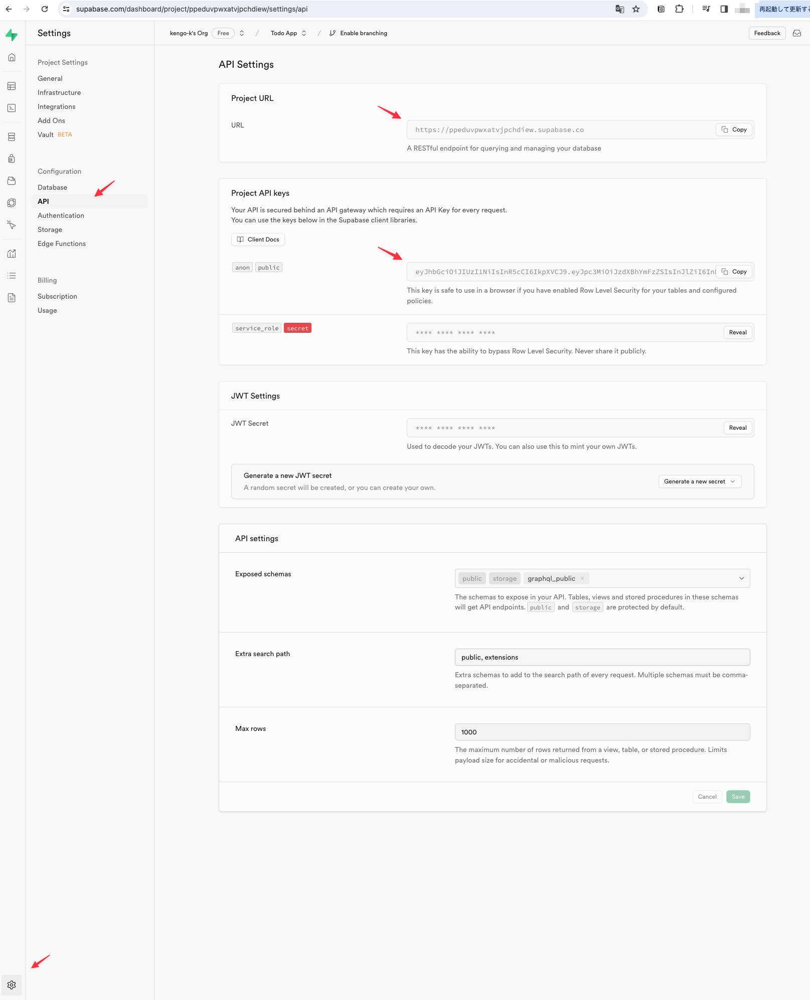

# Supabaseのセットアップ

## 「New project」をクリックする

## 下記の内容を設定し「Create new project」をクリックする

- Name: Todo App
- Database Password: 任意のパスワードを設定し控えておくこと
- Region: Northeast Asia (Tokyo)

## 初期化が完了するまで待つ

## 初期化が完了したら左メニューから「Authentication」をクリックする

## さらに「Providers」を選択し認証方法の一覧からEmailの設定を変更し「Save」をクリックする

- Confirm email: OFF

## 左メニューから「Table Editor」をクリックする

## 「Create a new table」をクリックする

## 下記の内容を設定して「Add foreign key relation」をクリックする

## 下記の内容を設定して関連を保存する

## テーブル作成の入力内容を確認しテーブルを作成する

※ Nameが未入力なのはミス。`todos`と設定すること

## さらに下記の内容に従いテーブルを作成する(`notices`テーブル)

## todosテーブルを開き`Insert`ボタンをクリックする

## 下記内容を入力しレコードを追加する

- title: Task 1

## さらにレコードを追加しテーブルの内容を確認する

## 同様に`notices`テーブルにもレコードを追加する

## 左メニュー「Project Settings」を開き、「API」サブメニューを開き、下記の内容を控える

- Project URL
- Project API keys

