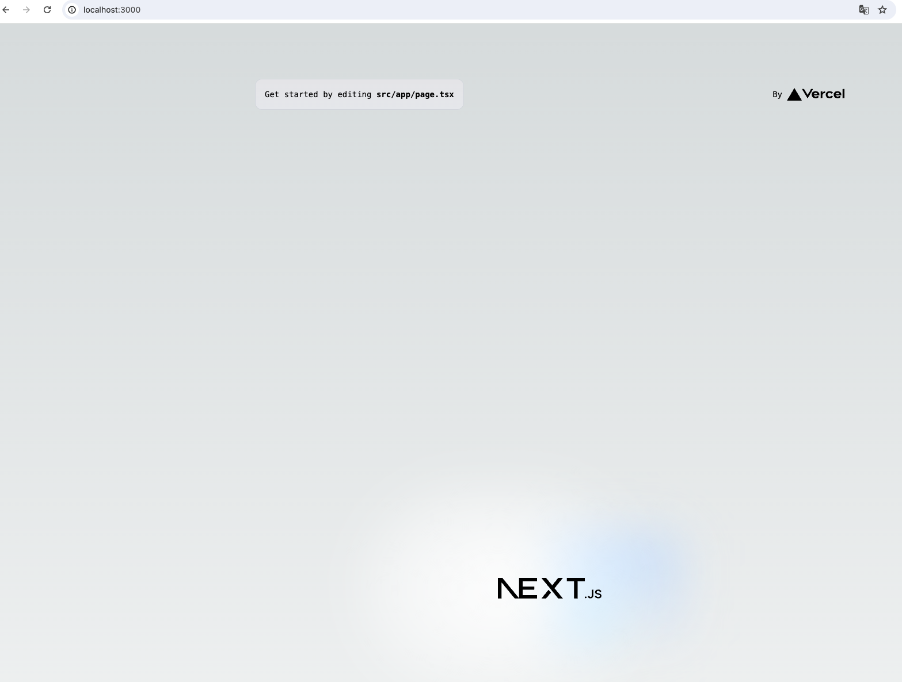

# プロジェクトの作成

nodeとyarnはインストール済みの前提とする。

※ nodeイメージを使用する場合はインストール済み

## NextJsプロジェクトの作成

- 道中の質問には全てYesで進める

```bash
$ npx create-next-app todo-app --typescript

✔ Would you like to use ESLint? … No / Yes
✔ Would you like to use Tailwind CSS? … No / Yes
✔ Would you like to use `src/` directory? … No / Yes
✔ Would you like to use App Router? (recommended) … No / Yes
✔ Would you like to customize the default import alias (@/*)? … No / Yes
✔ What import alias would you like configured? … @/*
Creating a new Next.js app in /app/todo-app.
```

## 作成したプロジェクトを起動する

```
$ yarn run dev

yarn run v1.22.19
$ next dev
   ▲ Next.js 14.1.1
   - Local:        http://localhost:3000
```

